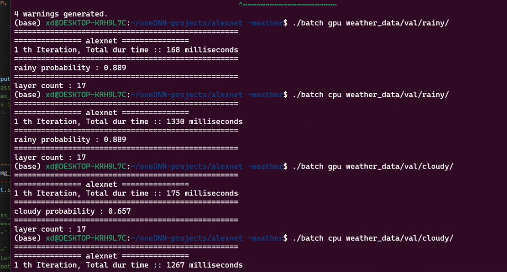
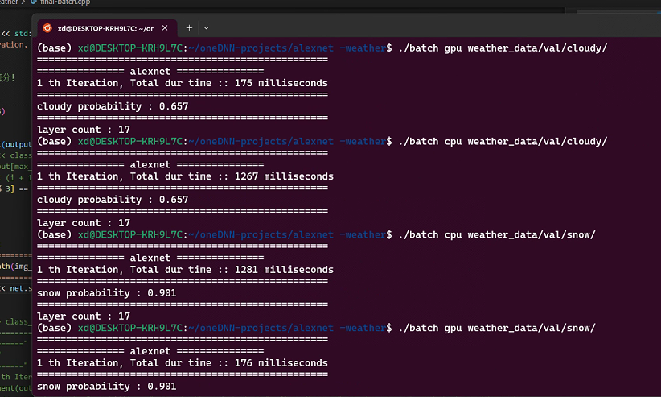
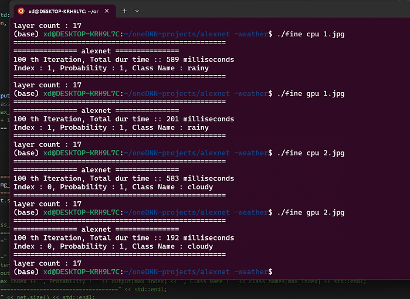
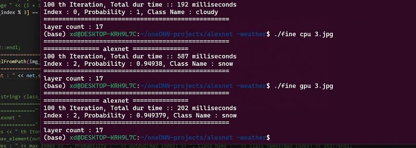
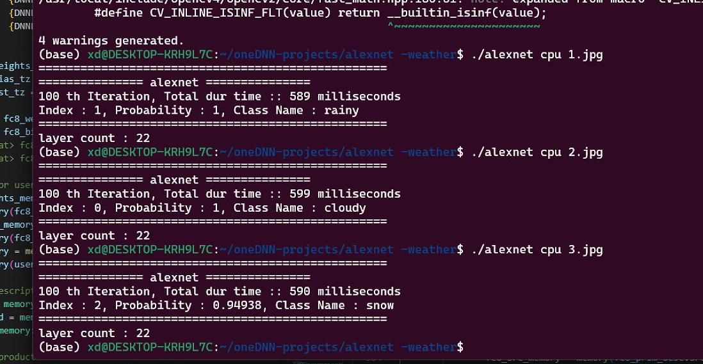

# oneDNN 在天气图像推理方面的应用

## 简介

本方案是以 AlexNet 为基准，使用 oneDNN 直接编程，搭建了 19 个包含卷积、激活函数、全连接在内的原语，并且能够在 Intel Arc A770 GPU 和 13th Gen Intel(R) Core(TM) i5-13600KF CPU 进行推理。其中，

- 图像使用 OpenCV 进行处理
- 权重数据使用 numpy 和 cnpy 将 pytorch、tensorflow 等主流权重格式数据转换为 C++数组 供 oneDNN 使用,增强了 oneDNN 生态，仓库也直接提供了转换工具，方便进行其它模型数据的转换。

## 文件目录


```bash
│  alexnet.cpp
│  example_utils.hpp
│  final-app.cpp
│  final-batch.cpp
│
├─example
│  │  1.jpg
│  │  2.jpg
│  │  3.jpg
│  │
│  └─picture
│          6.11-1.png
│          6.11-2.png
│          6.11-3.png
│          6.11-4.png
│          6.11-5.png
│          6.11-6.png
│
└─pytorch
        class_indices.json
        cloudy_00002.jpg
        Digraph.gv
        Digraph.gv.pdf
        fine_tune.py
        predict.py
        rainy_00009.jpg
        snow_00190.jpg
        weight.py
```

- alexnet.cpp 是算子融合前的文件
- final-app.cpp 是算子融合后，单张推理的文件
- final-batch.cpp 是算子融合后，多张推理，测试准确率的文件
- example_utils.hpp 不多说，熟悉 oneDNN 的人就知道它是什么了
- example 是推理测试图片
- pytorch 顾名思义
  - fine_tune.py 是训练文件
  - predict.py 是推理文件
  - weight.py 是权重格式转换 npy 的文件

## 演示效果








## 编译与运行

> 首先，权重文件太大了，仓库就没有上传，如果有需要的可以提 issue 或者邮箱咨询我，此外你还可以直接使用代码工具自己生成一个。
>
> 数据集采用深圳大学开眼的 MWD 数据集。
> 
> 安装 OpenCV 、 cnpy 库、 oneAPI 基础套件

1. 激活 oneAPI 环境，`source /opt/intel/oneapi/setvars.sh`
2. 编译命令```dpcpp alexnet.cpp -ldnnl `pkg-config opencv4 --cflags` `pkg-config opencv4 --libs` -lcnpy -o test``` 

   或者 ```icpx -fsycl alexnet.cpp -ldnnl `pkg-config opencv4 --cflags` `pkg-config opencv4 --libs` -lcnpy -o test```
3. 运行命令
   - 如果是编译`alexnet.cpp`或者`final-app.cpp`，使用`./test cpu 1.jpg`，第一个是编译文件地址，第二个是设备，如果电脑支持 GPU，可以换成 GPU，第三个参数是图片地址，可以是绝对地址也可以是相对地址
   - 如果是`final-batch.cpp`，使用`./test cpu /data/rainy/val`第三个参数变为某数据集一个分类的目录。

> 如何让 oneAPI 支持 GPU？可以看我的[博客教程](https://dyedd.cn/921.html) 或者[CSDN同步链接](https://blog.csdn.net/qq_28356373/article/details/128205189?spm=1001.2014.3001.5502)

## 致谢

**最后，感谢教育部-英特尔产学合作专业综合改革项目提供的 DevCloud 平台支持，感谢英特尔亚太研发有限公司技术团队提供的技术支持。**

**有关高性能计算课程及相关资料请参阅以下链接：**

[基于 OneAPI 的高性能计算](https://faculty.xidian.edu.cn/hmzhu/zh_CN/article/336134/content/1891.htm#article)

[高性能计算实验（教育部产学合作协同育人项目）](https://faculty.xidian.edu.cn/hmzhu/zh_CN/article/336134/content/1891.htm#article)

欢迎加入我们的课题组~